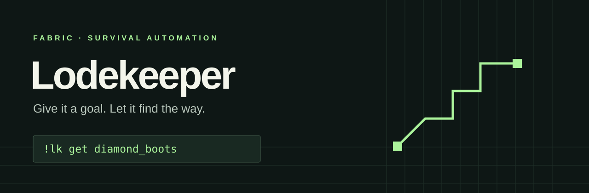

<p align="center"></p>

<p align="center">
  <a href="LICENSE"></a>
  
  
</p>

# Lodekeeper

**Give it a goal. Let it do the work.** Lodekeeper is a Minecraft Fabric client mod for survival resource gathering and crafting. It uses ordinary player actions to collect resources and complete crafting chains. [Preview 11](https://github.com/luinbytes/lodekeeper/releases/tag/v0.1.0-preview.11) is the latest development release for Minecraft 1.21.1 and 26.3. It embeds its owned navigation kernel. Known gameplay failures remain, including a 26.3 retreat failure and an inconclusive 1.21.1 survival attempt.

> **Preview 10 full loadout record.** Its exact jars made all five tools and equipped all four armor pieces in fresh survival worlds. The runs took 11:59 on 1.21.1 and 9:33 on 26.3. These timings belong to Preview 10 only. [Download Preview 10](https://github.com/luinbytes/lodekeeper/releases/tag/v0.1.0-preview.10). [Verified server runs](docs/NAVIGATION-REBUILD.md#exact-preview-10-263) record both results.

## Tell Lodekeeper what you need

```text
!lk help
!lk get wood 64
!lk get diamond_boots
!lk project gear_diamond
!lk plan diamond_boots
!lk pause
!lk resume
!lk stop
```

Lodekeeper makes prerequisite tools, places and uses crafting tables, and cooks through matching furnace, smoker, or blast furnace recipes. It also handles ordinary stonecutting. [Station limits](docs/PROCESSING-STATIONS.md) describe unsupported recipes and interactions.

Preview 11 embeds its licensed navigation kernel for movement, terrain breaking, scaffold placement, and item collection. It loads no separate Baritone runtime. Mining runs in batches. Compatible ore variants share a request, and bulk diamond jobs work in the deep band. Lodekeeper can carry its own crafting table between work sites and skip a blocked optional recovery. It checks the items that reach your inventory before advancing to crafting. Enable parkour with `!lk config allowParkour true`.

The compact status panel shows the current task, elapsed time, and route progress. The timer counts from the start of each goal or full project, including pauses. Use `!lk config showPath false` or `!lk config showHud false` to hide the path or panel. Lodekeeper displays the executing route and whether it is calculating the next segment. It does not expose expanded search nodes.

Lodekeeper writes a short progress trace to the launcher console and your instance `logs/latest.log`. If a task stalls, copy the `[Lodekeeper]` lines from `BEGIN` through the latest `PROGRESS` or `task_end`. They include the task, elapsed time, navigation phase, route events, and retries. Logging is enabled by default. Use `!lk config debugLogging false` to turn it off.

For large wood requests, try `!lk config optimizeWoodTools true`. This experimental option makes axes when estimated savings cover the full setup cost. New installations default it to on. Saved configurations retain their previous value. See [how tool investment works and its measured limits](docs/HARVEST-INVESTMENT.md).

`wood` means logs. Exact items use their registry names, including `minecraft:diamond_boots` and modded names such as `example:ruby`. Change the prefix with `!lk config prefix "your-prefix "`. Commands stay on your client.

## From an empty inventory to a finished goal

Lodekeeper works backward from what you ask for. It identifies ingredients, gathers supplies, makes tools, uses crafting and cooking stations, then checks the finished item in your inventory. The navigation kernel can calculate later path segments during movement. Lodekeeper waits for safe movement cancellation before taking control of inventory screens.

`!lk project gear_diamond` requests five diamond tools and four armor pieces. Armor equips automatically. Preview 10 passed one run in a new survival world on each primary version. An earlier source-owned run at `f8f4264` also completed the full loadout on 1.21.1. That historical pass does not verify the released `88f2b52` source. Terrain and resource availability affect completion time.

Counts are inventory targets. If you already have 20 logs, `!lk get wood 64` asks for 44 more. New requests join a queue. Use `!lk plan` to show the current plan or `!lk plan diamond_boots` to preview a goal before starting it.

`get` starts automatically. Close chat or other screens to let it run. Use `!lk status` to see discovery, planning, and movement progress. Bare `!lk` and `!lk help` show command guidance.

| Command | Use it to |
| --- | --- |
| `!lk status` / `!lk queue` | Check progress and queued goals |
| `!lk pause` / `!lk resume` | Interrupt and continue automation |
| `!lk clear` | Clear queued foreground goals |
| `!lk stop` | Stop and clear goals, including maintained stock |
| `!lk maintain oak_planks 64` | Experimentally replenish a stock target |
| `!lk maintained` / `!lk unmaintain all` | Inspect or remove stock targets |
| `!lk projects` / `!lk project <name>` | List or queue experimental inventory loadouts |

Stock maintenance yields to foreground goals. Projects collect inventory targets. Supply projects do not build structures or farms. Some presets include mechanics still in development and can report a blocker. Their gameplay acceptance is pending.

Unknown recipes and unsupported mechanics report a blocker. Modded items using ordinary recipes and interactions are a design target. Special machines need providers.

## Preview 11 release and known issues

[Preview 11](https://github.com/luinbytes/lodekeeper/releases/tag/v0.1.0-preview.11) uses source `88f2b523648e1e35c16db7e652aca1b719f002b3`. It builds the licensed navigation kernel into Lodekeeper under `dev.lodekeeper.navigation.kernel`. It does not load a separate Baritone runtime.

The source map covers 24 exact Minecraft profiles across 14 navigation source families. The shared core and navigation modules target Java 17. Each Fabric adapter targets the APIs for its exact profile. The [matrix at `bf68249`](https://github.com/luinbytes/lodekeeper/actions/runs/37632112439) passed all 24 profiles after one dependency download retry. At `88f2b52`, both primary adapters compile locally and pass 270 existing checks. The [exact-source CI run](https://github.com/luinbytes/lodekeeper/actions/runs/37660233575) finished with a failed full matrix at newer input diagnostics. Both primary jobs passed. Their [packaging receipt](docs/evidence/builds/preview11-88f2b52.json) confirms byte-for-byte matches with the native gameplay and GUI jars. Only those two versions are included in Preview 11. The [checkpoint](docs/OWNED-PREVIEW-CHECKPOINT.md) records source-specific hashes, current gates, and historical failures. The earlier [matrix at `89380e6`](https://github.com/luinbytes/lodekeeper/actions/runs/37642066956) finishes with five passing jobs and nineteen failures before runner acquisition. Those nineteen profiles remain uncompiled at that source. A successful build does not establish gameplay support.

The 23 advanced navigation options are available in the settings GUI. Open it with Right Shift or `!lk config`. The settings screen suspends automation while it is open. Save applies the draft; Escape discards it. The `Protected plots` button opens the claim editor.

Claims are 3D boxes scoped to the current world and dimension. The GUI accepts a name and two XYZ corners. These client commands select corners and create or list a claim.

Each `pos` command records the block under your crosshair. If you are not targeting a block, it records your block position.

```text
!lk claim pos1
!lk claim pos2
!lk claim add home preferred
!lk claim list
```

Use `!lk claim prefer home false` to turn off station preference. Use `!lk claim remove home` to remove a claim. `!lk claim clear` clears the pending corner selection. It does not remove saved claims.

Protected claims block automated breaking and placing. Placement checks include the target and adjacent support blocks, including the six possible faces for torch placement. If world identity or claim data cannot be checked, automated block edits pause. Lodekeeper prefers usable stations that are already loaded in claims marked for stations. Station pickup checks the exact drop UUID and server receipts. Cleanup has a limit of 60 seconds. It reports skipped stations or incomplete pickups.

Optional backfill uses only surplus stone or cobblestone after other goals and reserves. It does not gather blocks just to restore the route.

Earlier progression and GUI checks passed nine cases on both primary adapters. The historical GUI at `ce3c967` passes all ten checks on both primary versions. The exact `88f2b52` settings GUI passes all ten checks on each primary version, twenty checks in total. The [native QA receipt](https://github.com/luinbytes/lodekeeper/releases/download/v0.1.0-preview.11/native-qa.json) covers shield controls, saving test floors of nineteen iron and thirty-seven planks, dependent-control disabling, discard, protected plots, and restoration of the original settings. These test floors do not change the defaults of two iron and sixteen planks. All eighteen shield modes pass at `ce3c967`, including queued-goal reservations, native blocking, occupied offhand, and simulated manual takeover. The shield results describe `ce3c967` only. The historical inventory A/B sequence has five progression passes each, one extra baseline timeout, and one candidate station-cleanup failure. Current-build counted timing remains pending; no released-build speed claim is made.

At `88f2b52`, fresh 26.3 survival fails after 63,753 ms during the third skeleton retreat from source water. The first two retreats clear; the third path calculation fails before an executor starts. Minimum and final health are 7.499998, with no deaths, an empty cursor, and no diamond gear. The exact search stop reason remains unknown. The 1.21.1 attempt is `INCONCLUSIVE_ENVIRONMENT_ABORT`: storage writes report `ENOSPC`, the runner exits with code 120, and neither a final native JSON nor a finished runner receipt exists. The exact client termination cause is unknown.

Earlier `f8f4264` evidence includes one 1.21.1 full diamond loadout pass in 11:24, a same-seed timeout at 900,181 ms, and a 26.3 raw-iron WALL_TIME failure at 441,801 ms. The pass observed no hazard and left a distant owned station outside recovery range. The water stalls remain separate unresolved cases. Vertical bobbing falsely counted as navigation progress; each stall's physical cause remains unproved. Shield, the 37-value native lease, other safety, station cleanup, and counted timing gates remain pending at the released source. The earlier `89380e6` and `71462f2` inventory-transfer failures remain unresolved. See the [checkpoint](docs/OWNED-PREVIEW-CHECKPOINT.md) for exact hashes and evidence.

`autoDefend` and `autoUseShield` default to `true`. `autoCraftShield` defaults to `false` and is available only when `autoUseShield` is enabled. `shieldIronReserve` defaults to 2 ingots; `shieldPlankReserve` defaults to 16 planks. Each accepts 0 through 4096. Shield planning protects active and queued goals, non-aborted project targets, and maintained stock before applying the floors. It uses spare stored materials and never gathers iron or planks just to craft a shield. The settings GUI labels the values `Iron ingots to keep` and `Planks to keep`.

Shield defense preserves non-shield offhand items and uses a plain shield only when it has more than 100 durability remaining. A detected creeper is never a melee target. The bounded retreat response starts only after owned inventory transactions drain, station menus close, and food and equipment work yield. It can pause when no safe reachable path is available. Earlier `98a7856` live-creeper checks pass on both primary versions, but the f8 natural run did not observe a hazard and does not verify this response. See the [Preview 11 checkpoint](docs/OWNED-PREVIEW-CHECKPOINT.md) for current gates and the [verification guide](docs/GAME-VERIFICATION.md) for fixture details.

## Installation and compatibility

[Download Preview 11](https://github.com/luinbytes/lodekeeper/releases/tag/v0.1.0-preview.11) for 1.21.1 or 26.3. Its navigation kernel is embedded in Lodekeeper. Replace your previous Lodekeeper jar before launching.

1. [Install Fabric](https://docs.fabricmc.net/players/installing-fabric/) for your exact Minecraft Java version.
2. Place `lodekeeper-<minecraft-version>-0.1.0-preview.11.jar` and the matching Fabric API jar in your instance `mods` folder. Keep one Lodekeeper jar. [Fabric's mod-installation guide](https://docs.fabricmc.net/players/installing-mods) explains the folder locations.
3. Launch that Fabric profile, enter a world, and try `!lk get wood 8`.

Each Preview 11 jar targets one exact release. This release includes only 1.21.1 and 26.3. Both jars passed their CI jobs and packaging checks; known gameplay failures remain as described above. [Preview 10](https://github.com/luinbytes/lodekeeper/releases/tag/v0.1.0-preview.10) provides older-source jars across all 24 declared profiles from 1.20 through 26.3. Its compilation and selected gameplay results are historical. [Compatibility evidence](docs/COMPATIBILITY.md) separates those results from untested gameplay. Use server automation where the server permits it.

---

<details>
<summary><strong>Development, architecture, and verification</strong></summary>

Source lives in `core` for acquisition and commands, `nav` for route views and earlier navigation models, and the Fabric adapters for Minecraft integration. Preview 11 builds the owned navigation kernel described above into Lodekeeper. Builds run with one worker and no persistent daemon. Set `JAVA_HOME` to the JDK required by the exact game profile. Development artifacts still need their exact build and native checks.

Preview 10 binaries come from source `852b72f177befc1b55771cee86076544f39c9f9b` and [its successful CI run across 24 profiles](https://github.com/luinbytes/lodekeeper/actions/runs/37478984017). The exact [1.21.1](docs/evidence/navigation-rebuild/checkpoint-14.json) and [26.3 fresh world receipts](docs/evidence/navigation-rebuild/checkpoint-15.json) confirm the complete loadout. Prepared workbench checks on both primary versions use the earlier `7ba8d375` source. Their supplies and geometry are declared in the evidence. Earlier failures remain in the [rebuild record](docs/NAVIGATION-REBUILD.md).

Preview 11 includes SHA-256 checksums, [packaging evidence](docs/evidence/builds/preview11-88f2b52.json), native QA, and corresponding source archives. Its thirty public assets include twenty-three original captures and seven build, source, and QA assets. Five captures use the exact released source; eighteen retain historical source labels. Two original MP4s are flagged unplayable. All thirty asset links returned anonymous HTTP 200, and all ten release screenshots loaded in the browser. Lodekeeper code uses the MIT licence. The included Baritone source retains LGPL-3.0-or-later notices. [Dependency notices and source access](third-party/baritone/NOTICE.md) list the pinned source locks and rebuild details.

The [main matrix at `96e017a`](https://github.com/luinbytes/lodekeeper/actions/runs/37686183173) passes all 24 profiles. Both primary builds pass 270 existing checks. The [unchanged reachable and blocked workbench controls](docs/evidence/survival-safety/main-96e017a-workbench.json) pass on both versions, verifying bounded recovery of a previous completed command's table. Fresh survival still fails: [26.3](docs/evidence/survival-safety/main-96e017a-natural-modern.json) makes one diamond pickaxe before a skeleton-retreat calculation failure; [1.21.1](docs/evidence/survival-safety/main-96e017a-natural-primary.json) stops at an inventory-return mismatch. Both retain full health, zero observed deaths and an empty cursor. These results do not change Preview 11's released binaries or establish a speedup.

The [main matrix at `1bd4f5a`](https://github.com/luinbytes/lodekeeper/actions/runs/37692154343) passes all 24 profiles. That source bounds repeated movement credit to 8,192 distinct directed cell edges per logical action. The three approved regressions and 95 existing navigation checks pass. Subsequent `0ec8e88` gameplay results are recorded below; the earlier physical water and retreat failures remain unresolved.

At `0ec8e88`, both primary adapters compile and pass 297 checks, including 24 approved inventory receipt regressions. The [exact-source CI matrix](https://github.com/luinbytes/lodekeeper/actions/runs/37696100736) passes all 24 profiles. Frozen jars pass all four [workbench controls](docs/evidence/survival-safety/main-0ec8e88-workbench.json), both [prepared water retreats](docs/evidence/survival-safety/main-0ec8e88-water.json), and all eighteen [controlled progression cases](docs/evidence/survival-safety/main-0ec8e88-progression.json), including native crafting and iron smelting. The [settings GUI](docs/evidence/survival-safety/main-0ec8e88-gui.json) passes twenty checks across the two versions and restores the original settings. These results do not establish a speedup or complete interruption coverage.

Fresh Survival still fails at `0ec8e88`. The [1.21.1 run](docs/evidence/survival-safety/main-0ec8e88-natural-primary.json) reproduces the previous full-reply/later-slot ordering and continues through stone-pickaxe crafting. It later pauses with one diamond pickaxe and no armor because no safe dry retreat candidate remains. The [26.3 run](docs/evidence/survival-safety/main-0ec8e88-natural-modern.json) ends in a zombie death while air recovery is active. Neither completes the full loadout. These main results do not change Preview 11's released binaries.

Clean main `9cbf94eaa2e57a2c28c5e04a902026851053ba52` compiles both primary adapters, passes 297 checks, and passes all 24 [exact-head CI profiles](https://github.com/luinbytes/lodekeeper/actions/runs/37702345003). Both unchanged [prepared air controls](docs/evidence/survival-safety/main-9cbf94e-air.json) pass with supplied stock and no hostiles. They verify read-only diagnostics and fixture recovery.

The [fresh 1.21.1 run](docs/evidence/survival-safety/main-9cbf94e-natural-primary.json) completes five diamond tools and four equipped armor pieces in 509,245 ms (8:29). Health stays 20, with zero deaths, an empty cursor, and idle cancelled navigation. Its start differs from earlier same-seed attempts. Two threat responses clear the same creeper without melee. The [fresh 26.3 run](docs/evidence/survival-safety/main-9cbf94e-natural-modern.json) fails after 45,633 ms during a crafting drag, leaving one cobblestone on the server cursor and the menu open. The first reply's originating packet remains unproved. Later main code waits on an exact confirmed pre-drag state while still requiring the exact final reply; native verification of that change is pending. Neither fresh run observes air recovery or reproduces the `0ec8e88` zombie death. The [checkpoint](docs/OWNED-PREVIEW-CHECKPOINT.md#latest-main-evidence) records remaining shield, native lease, station recovery, and interruption limits. This is one primary pass, with no comparative speed result. Preview 11 remains unchanged; no Preview 12 is published.

New verification uses screenshots. The [work-in-progress evidence release](https://github.com/luinbytes/lodekeeper/releases/tag/main-gameplay-evidence) receives labelled screenshots between previews. Its results apply to the named main commits, separately from Preview 11.

- [Navigation and survival rebuild](docs/NAVIGATION-REBUILD.md)
- [Dependency notices and source access](third-party/baritone/NOTICE.md)
- [Stack and delivery plan](docs/STACK.md)
- [Owned automation plan](docs/OWNED-AUTOMATION-PLAN.md)
- [Preview 11 development checkpoint](docs/OWNED-PREVIEW-CHECKPOINT.md)
- [Architecture](docs/ARCHITECTURE.md)
- [Version and gameplay evidence](docs/COMPATIBILITY.md)
- [Isolated gameplay verifier](docs/GAME-VERIFICATION.md)
- [Custom block drop contracts](docs/CUSTOM-CONTENT.md)
- [Full mechanic coverage ledger](docs/COVERAGE.md)
- [Processing stations and their limits](docs/PROCESSING-STATIONS.md)
- [Local resource planning and discovery](docs/LOCAL-PLANNING.md)
- [Collision-shape navigation and limits](docs/NAVIGATION-SHAPES.md)
- [Navigation performance investigations](docs/NAVIGATION-PERFORMANCE.md)
- [Movement research and next experiments](docs/MOVEMENT-DESIGN.md)
- [Bootstrap planning and safe approaches](docs/BOOTSTRAP-PLANNER.md)
- [Repository instructions](AGENTS.md)

Performance comparisons with AltoClef or Baritone require equivalent gameplay benchmarks. This project makes no superiority claim before those measurements exist.

</details>
